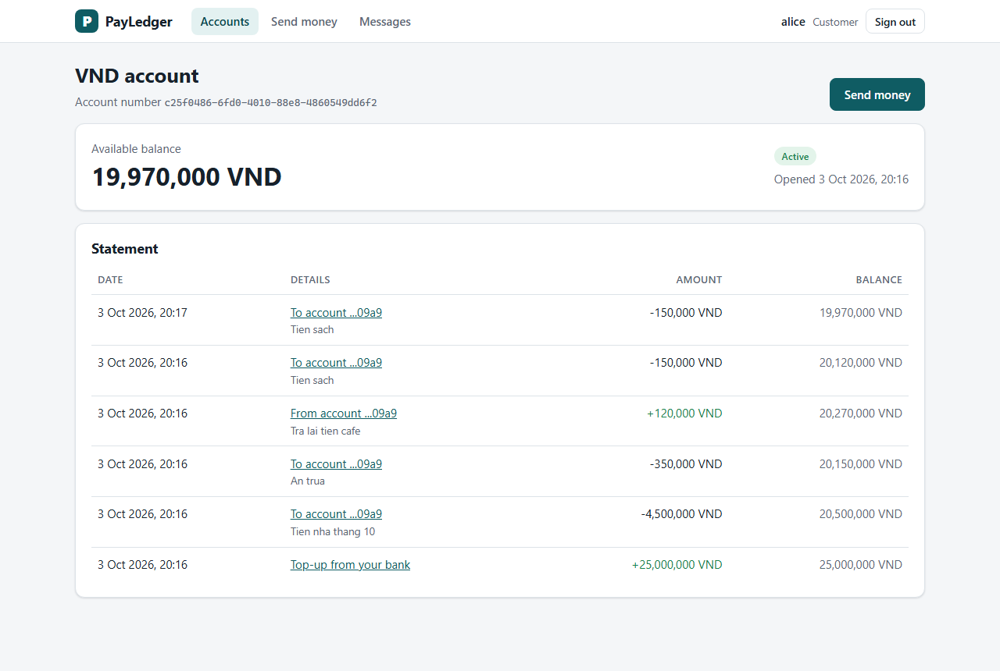
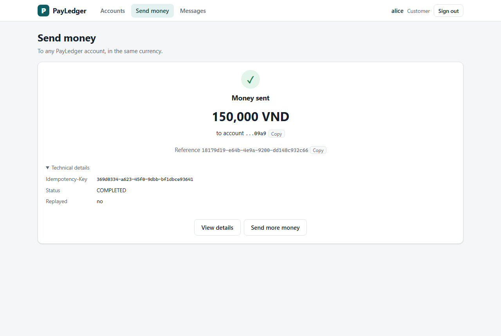
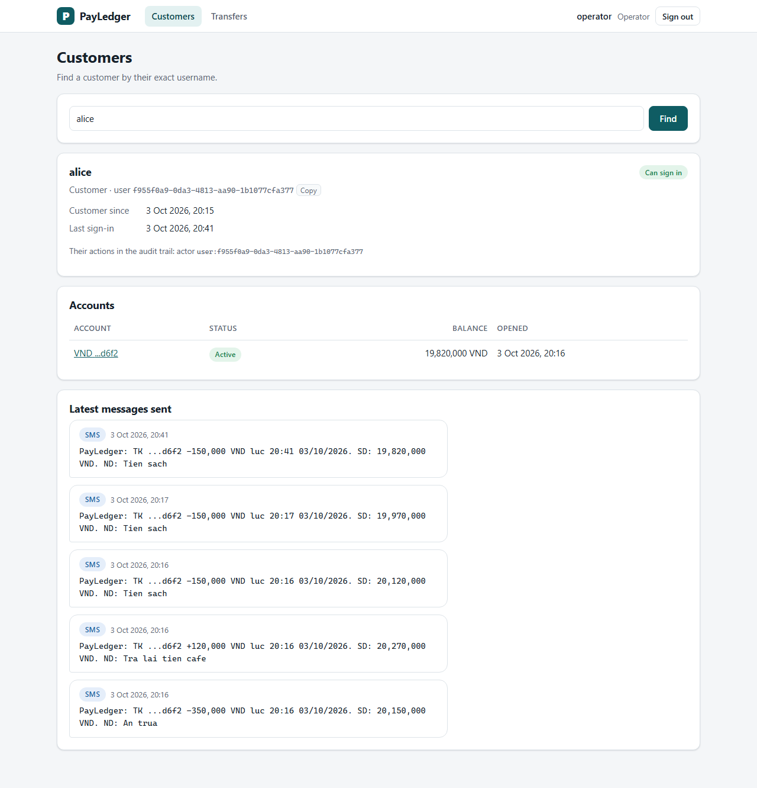
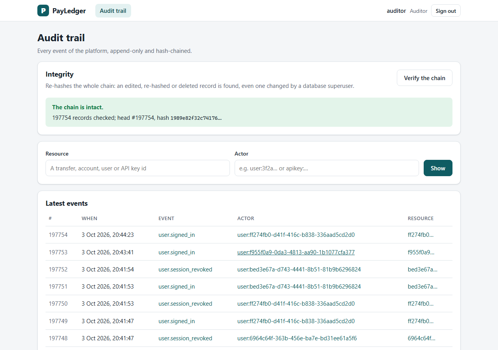

# Payment Processing & Ledger Platform

A banking-oriented payment platform: accounts, money transfers with a double-entry ledger,
idempotent APIs, concurrency-safe balance updates, and event-driven downstream processing.

> Status: **Phase 6 – Frontend & polish** done: a React web app for customers, operators, auditors and admins, typed
> from the services' OpenAPI documents; browser sessions with the refresh token in an HttpOnly cookie; account
> statements; the whole stack in Docker; a k6 load test. See the [plan](docs/PLAN.md) for what comes next.

## Architecture

```
Web app (React + TS) ── nginx ──┐  one origin; Bearer access token (ES256 JWT), refresh token in an HttpOnly cookie
Partner bank ───────────────────┤  X-API-Key (deposits only)
                                ▼
            Core Service (Spring Boot, modular monolith)
            ├── security   ✅ sign-in, tokens, JWKS, RBAC, API keys, rate limit ──► Redis (token buckets)
            ├── account    ✅
            ├── transfer   ✅ ─┐
            ├── ledger     ✅ ─┤ one DB transaction
            └── outbox     ✅ ─┘
                    │
              PostgreSQL ◄── Outbox relay ✅ ──► Kafka: payledger.transfers / .accounts / .security
                                                   ├── Notification Service ✅ (own DB)
                                                   └── Audit Service ✅ (own DB, hash chain)
                                      both verify tokens with the core's public keys (JWKS)

  Observability ✅  metrics ──► Prometheus (+ kafka-exporter for lag, alert rules) ──► Grafana dashboards
                    traces (OTLP) ──► Jaeger: one trace per payment, HTTP → outbox → Kafka → consumers
                    logs: JSON lines (ECS) with trace.id on stdout
```

Key design decisions are recorded in [docs/adr](docs/adr):

| ADR | Decision |
|---|---|
| [0001](docs/adr/0001-modular-monolith-first.md) | Modular monolith first |
| [0002](docs/adr/0002-money-as-minor-units.md) | Money as integer minor units |
| [0003](docs/adr/0003-synchronous-ledger-with-outbox.md) | Synchronous ledger, transactional outbox for events |
| [0004](docs/adr/0004-pessimistic-row-locking-for-transfers.md) | Pessimistic row locks in id order ([benchmark](docs/benchmarks/locking.md)) |
| [0005](docs/adr/0005-idempotency-keys.md) | Idempotency keys stored in the same transaction as the operation |
| [0006](docs/adr/0006-double-entry-ledger-model.md) | Double-entry ledger model, SYSTEM accounts, reversals |
| [0007](docs/adr/0007-polling-outbox-relay.md) | Polling outbox relay with `SKIP LOCKED`, ordered per aggregate |
| [0008](docs/adr/0008-idempotent-consumers-retry-topics-dlq.md) | Idempotent consumers, non-blocking retry topics, dead-letter topics |
| [0009](docs/adr/0009-tamper-evident-audit-log.md) | Tamper-evident audit log in its own service |
| [0010](docs/adr/0010-authentication-tokens.md) | ES256 access tokens, JWKS, rotating refresh tokens, Argon2id passwords and lockout |
| [0011](docs/adr/0011-authorization-and-api-keys.md) | Role-based and object-level authorization, API keys for machine clients |
| [0012](docs/adr/0012-rate-limiting.md) | Token-bucket rate limiting in Redis, failing open |
| [0013](docs/adr/0013-metrics-and-alerting.md) | Business metrics counted after commit, consumer lag from the broker, symptom-based alerts |
| [0014](docs/adr/0014-trace-context-and-structured-logs.md) | One trace through the outbox (CloudEvents `traceparent`), `X-Trace-Id` and FAPI interaction id, ECS JSON logs |
| [0015](docs/adr/0015-browser-sessions.md) | Browser sessions: refresh token in an HttpOnly `SameSite=Strict` cookie, access token in memory, Web Locks across tabs |
| [0016](docs/adr/0016-openapi-contract.md) | OpenAPI generated from the code, committed and contract-tested, TypeScript client types generated from it |

The event contract is documented in [docs/events.md](docs/events.md); what to do when an alert fires, in
[docs/runbook.md](docs/runbook.md).

## Tech stack

**Backend:** Java 21 · Spring Boot 4.1 · Spring Security 7 (OAuth 2.0 resource server, Nimbus JOSE) · springdoc-openapi ·
PostgreSQL 17 · Flyway · Kafka 4 (KRaft) · Redis + Bucket4j · Micrometer + OpenTelemetry · Testcontainers

**Frontend:** React 19 · TypeScript · Vite · TanStack Query · React Router · openapi-typescript + openapi-fetch · Vitest

**Operations:** Docker Compose · nginx · Prometheus · Grafana · Jaeger · kafka-exporter · k6 · GitHub Actions

## Getting started

### Everything in Docker

Prerequisites: Docker only.

```bash
cd infra
echo "PAYLEDGER_ADMIN_PASSWORD=choose a passphrase of 15+ chars" > .env   # the first ADMIN; .env is git-ignored
docker compose --profile app up -d --build --wait
PAYLEDGER_ADMIN_PASSWORD='choose a passphrase of 15+ chars' ../scripts/seed-demo.sh
```

Then open **http://localhost:8088** and sign in as `alice` or `bob` (customers), `operator`, `auditor`
(password `correct horse battery staple`) or `admin`. The `app` profile builds the three services and the web app
(nginx serving the app and proxying `/api` to the services) on top of the infrastructure below; without it, only the
infrastructure starts.

### Developing

Prerequisites: JDK 21, Node.js 22, Docker.

```bash
# 1. Start infrastructure
cd infra
docker compose up -d --wait

# 2. Run the core service. The password creates the first ADMIN (15+ characters, used only while no ADMIN exists).
cd ../backend
PAYLEDGER_ADMIN_PASSWORD='dev-only bootstrap passphrase' ./mvnw spring-boot:run

# 3. (Optional) Run the consumers, each in its own terminal
cd ../services/audit-service && ./mvnw spring-boot:run
cd ../services/notification-service && ./mvnw spring-boot:run

# 4. The web app on http://localhost:5173, proxying /api to the services above
cd ../../frontend && npm ci && npm run dev
```

| Service     | URL                                  | Notes                       |
|-------------|--------------------------------------|-----------------------------|
| Web app     | http://localhost:8088 (Docker), http://localhost:5173 (`npm run dev`) | |
| Core API    | http://localhost:8080/api/v1         | Sign in as `admin` with the password above |
| API reference | http://localhost:{8080,8082,8083}/swagger-ui.html | OpenAPI 3.1 at `/v3/api-docs` |
| JWKS        | http://localhost:8080/.well-known/jwks.json | Public keys the other services verify tokens with |
| Audit API   | http://localhost:8082/api/v1/audit-events |                        |
| Notifications API | http://localhost:8083/api/v1/notifications |                 |
| Metrics     | http://localhost:{8080,8082,8083}/actuator/prometheus |            |
| PostgreSQL (core) | localhost:15432                | payledger / payledger       |
| PostgreSQL (audit) | localhost:15433               | audit_owner (migrations), audit_app (app) |
| PostgreSQL (notification) | localhost:15434        | notification / notification |
| Redis       | localhost:16379                      |                             |
| Kafka       | localhost:29092                      |                             |
| Kafka UI    | http://localhost:8081                |                             |
| Prometheus  | http://localhost:9090                | Alert rules under `/alerts` |
| Grafana     | http://localhost:3000                | admin / admin; dashboards in the *PayLedger* folder |
| Jaeger      | http://localhost:16686               | Traces; OTLP/HTTP on 4318   |
| kafka-exporter | http://localhost:9308/metrics     | Consumer lag                |

Host ports are shifted from the defaults so they don't clash with locally installed services;
override them with `POSTGRES_PORT`, `REDIS_PORT`, `KAFKA_PORT`, etc.

Without `PAYLEDGER_JWT_SIGNING_KEY` (a private P-256 JWK), the core signs tokens with a random key generated at
startup and logs a warning: tokens then die with the process. Fine locally, not for more than one instance.

Logs are JSON lines (Elastic Common Schema). For plain text in a terminal, start a service with `LOG_FORMAT=`
(empty), e.g. `LOG_FORMAT= ./mvnw spring-boot:run`.

## Web app

One single-page app (React, TypeScript, [frontend/](frontend)) for everyone; what it shows depends on the role in
the access token. The server authorizes every request on its own, so a hidden screen is a convenience, not a guard.

| Role | Screens |
|---|---|
| Customer | Accounts and balances, opening an account · a statement per account (newest first, cursor-paged) · sending money (form → review → confirm) · a payment's details · the balance-change SMS received |
| Operator | Find a customer by username: profile, lockout and unlock, accounts with freeze / unfreeze, the SMS sent · open any payment by its reference and reverse it |
| Auditor | The latest events, or one actor's · the full story of one transfer, account, user or key · verify the hash chain |
| Admin | Create staff users · issue API keys (shown once) and revoke them · plus the operator and auditor screens |

| Statement | Money sent (idempotent) | Support desk | Audit trail |
|---|---|---|---|
| [](docs/screenshots/statement.png) | [](docs/screenshots/money-sent.png) | [](docs/screenshots/support-desk.png) | [](docs/screenshots/audit-trail.png) |

Also: [a customer's accounts](docs/screenshots/accounts.png), [on a phone](docs/screenshots/mobile.png).

- **Sessions without a stealable credential.** The refresh token lives in an `HttpOnly`, `SameSite=Strict` cookie
  scoped to `/api/v1/auth/browser`; the 5-minute access token only in memory. Refreshes are serialised across tabs
  with the Web Locks API, so two tabs never trip refresh-token reuse detection. Sign-out reaches every tab. nginx sends
  a strict Content Security Policy ([ADR 0015](docs/adr/0015-browser-sessions.md)).
- **Idempotent from the click.** The `Idempotency-Key` of a payment is created when the customer reaches the
  confirmation step and kept for every attempt: a double click, or "Try again" after a timeout or a `503 LOCK_TIMEOUT`,
  sends the same key, and the server replays the first outcome instead of paying twice. The app says so when a
  response was a replay. Editing the payment starts over with a new key.
- **Errors a bank would show.** A plain sentence per problem `code`, the server's detail, the fields that failed
  validation, and a **reference**: the response's `X-Trace-Id`, which support can paste into Jaeger, the logs or the
  audit trail.
- **Typed by the API itself.** The TypeScript types are generated from the services' OpenAPI documents, which the
  backend's contract tests keep equal to the code; an API change that the app does not follow fails the build
  ([ADR 0016](docs/adr/0016-openapi-contract.md)).
- **Money as text.** Amounts are integers in minor units end to end; what a person types is parsed digit by digit
  (`0.29` USD is 29 cents, not 28.999…), and an extra decimal is refused, never rounded.

## API

Every endpoint except sign-up, sign-in, refresh, sign-out, the JWKS and the probes needs credentials: a bearer
access token for people, an `X-API-Key` for machine clients. "Own" means accounts whose owner is the caller.

Every response carries `X-Trace-Id` (quote it to support) and `x-fapi-interaction-id` (the caller's own UUID echoed
back, as in FAPI / open banking, or a new one). A client may send a W3C `traceparent` to join a trace it started.

### Authentication

| Method | Path                       | Access | Description |
|--------|----------------------------|--------|-------------|
| POST   | `/api/v1/auth/signup`      | anyone | Create a CUSTOMER (`username`, `password`) |
| POST   | `/api/v1/auth/login`       | anyone | Access token (5 min) + refresh token |
| POST   | `/api/v1/auth/refresh`     | anyone with a refresh token | New access token and new refresh token; the old one stops working |
| POST   | `/api/v1/auth/logout`      | anyone with a refresh token | End the session; always `204` |
| POST   | `/api/v1/auth/browser/login`, `/refresh`, `/logout` | the web app | The same, with the refresh token in an HttpOnly cookie instead of the body; require `X-Requested-With` ([ADR 0015](docs/adr/0015-browser-sessions.md)) |
| GET    | `/.well-known/jwks.json`   | anyone | Public signing keys (RFC 7517) |

```bash
curl -X POST localhost:8080/api/v1/auth/login -H 'Content-Type: application/json' \
  -d '{"username": "alice", "password": "correct horse battery staple"}'
# {"accessToken": "eyJ…", "tokenType": "Bearer", "expiresIn": 300,
#  "refreshToken": "q3Vt…", "refreshExpiresIn": 900}
```

### Users and API keys

| Method | Path                            | Access | Description |
|--------|---------------------------------|--------|-------------|
| GET    | `/api/v1/users/me`              | any user | The signed-in user |
| POST   | `/api/v1/users`                 | ADMIN | Create a user with any role (staff) |
| GET    | `/api/v1/users?username=`       | OPERATOR | Find a user by exact username (support desk) |
| GET    | `/api/v1/users/{id}`            | OPERATOR | Look a user up, including a lockout |
| POST   | `/api/v1/users/{id}/unlock`     | OPERATOR | Lift a sign-in lockout |
| POST   | `/api/v1/api-keys`              | ADMIN | Issue a key (`name`, `scopes`, optional `expiresAt`); the key is shown only in this response |
| GET    | `/api/v1/api-keys`, `/{id}`     | ADMIN | List keys (never the secret) |
| POST   | `/api/v1/api-keys/{id}/revoke`  | ADMIN | Revoke at once |

### Accounts

| Method | Path                                 | Access | Description |
|--------|--------------------------------------|--------|-------------|
| POST   | `/api/v1/accounts`                   | CUSTOMER | Open an account (`currency`); the owner is the caller |
| GET    | `/api/v1/accounts/{id}`              | own, OPERATOR | Account and balance |
| GET    | `/api/v1/accounts`                   | CUSTOMER | The caller's accounts |
| GET    | `/api/v1/accounts?ownerId=`          | OPERATOR | A customer's accounts |
| GET    | `/api/v1/accounts/{id}/ledger-entries?limit=&startingAfter=` | own, OPERATOR | Statement: ledger entries newest first, each with its movement, counterparty and balance after; cursor-paged like Stripe lists |
| POST   | `/api/v1/accounts/{id}/freeze`       | OPERATOR | ACTIVE → FROZEN |
| POST   | `/api/v1/accounts/{id}/unfreeze`     | OPERATOR | FROZEN → ACTIVE |
| POST   | `/api/v1/accounts/{id}/close`        | own, OPERATOR | → CLOSED (balance must be zero) |

### Money movement

All three `POST`s require an `Idempotency-Key` header.

| Method | Path                                 | Access | Description |
|--------|--------------------------------------|--------|-------------|
| POST   | `/api/v1/deposits`                   | API key `deposits:write` | Credit a customer with money received from outside (bank top-up) |
| POST   | `/api/v1/transfers`                  | CUSTOMER, from an own account | Move money to any customer account |
| GET    | `/api/v1/transfers/{id}`             | either party, OPERATOR | A deposit, transfer or reversal, including rejected ones |
| POST   | `/api/v1/transfers/{id}/reversals`   | OPERATOR | Reverse a completed deposit or transfer (`reason`) |

```bash
curl -X POST localhost:8080/api/v1/transfers \
  -H "Authorization: Bearer $ACCESS_TOKEN" \
  -H 'Content-Type: application/json' \
  -H 'Idempotency-Key: 6f1c2a9e-0d1b-4c55-9b3e-7a2f8e4d1c00' \
  -d '{"sourceAccountId": "…", "destinationAccountId": "…",
       "amount": 250000, "currency": "VND", "description": "Rent October"}'
```

Amounts are integers in the currency's minor unit. `currency` is required so a client cannot move the
wrong value by mistaking the unit.

A transfer rejected by a business rule is **recorded** as `FAILED` and returned as `422` with a stable
`code` and the `transferId`:

```json
{
  "status": 422,
  "title": "Unprocessable Content",
  "detail": "Account 3f2a… has insufficient funds for 250000 VND",
  "code": "INSUFFICIENT_FUNDS",
  "transferId": "9b0e…"
}
```

| Code | Meaning |
|---|---|
| `INSUFFICIENT_FUNDS` | The source account does not hold the amount |
| `SOURCE_ACCOUNT_NOT_ACTIVE` / `DESTINATION_ACCOUNT_NOT_ACTIVE` | An account is frozen or closed |
| `CURRENCY_MISMATCH` | An account is not in the requested currency |
| `ACCOUNT_TYPE_NOT_ALLOWED` | Customer transfers cannot touch SYSTEM accounts |
| `TRANSFER_NOT_REVERSIBLE` | Only COMPLETED, non-reversal transfers can be reversed |
| `LOCK_TIMEOUT` (503) | An account stayed locked too long; retry with the same key |

Security errors use the same format:

| Code | Status | Meaning |
|---|---|---|
| `AUTHENTICATION_REQUIRED` / `INVALID_TOKEN` / `INVALID_API_KEY` | 401 | No credentials, or bad ones |
| `INVALID_CREDENTIALS` | 401 | Wrong password or unknown username (indistinguishable on purpose) |
| `ACCOUNT_LOCKED` | 401 | 5 wrong passwords in a row; `Retry-After` says when the lock ends |
| `INVALID_REFRESH_TOKEN` / `REFRESH_TOKEN_REUSED` | 401 | Expired or ended session / a replayed token, which ends the session |
| `ACCESS_DENIED` | 403 | The caller's role does not allow this operation |
| `RESOURCE_NOT_FOUND` | 404 | Also for someone else's account or transfer, so ids cannot be probed |
| `RATE_LIMITED` | 429 | Too many requests; see `Retry-After` |
| `CSRF_CHECK_FAILED` | 403 | A browser session request without `X-Requested-With` |

Spring's own errors carry a code too: `INVALID_REQUEST` (400, with the offending fields in `invalidParams`),
`RESOURCE_NOT_FOUND`, `METHOD_NOT_ALLOWED` and so on. The full contract of each service is its OpenAPI document
(`/v3/api-docs`, Swagger UI at `/swagger-ui.html`), committed in [frontend/openapi](frontend/openapi).

### Idempotency

Follows the IETF *Idempotency-Key* draft with Stripe-style semantics ([ADR 0005](docs/adr/0005-idempotency-keys.md)).
Keys are scoped to the caller: two clients picking the same key never see each other's responses.

| Retry with the same key | Response |
|---|---|
| Same request, completed | Original response replayed byte for byte, `Idempotent-Replayed: true` |
| Different request | `422 IDEMPOTENCY_KEY_REUSED` |
| First request still running | `409 IDEMPOTENCY_KEY_IN_PROGRESS` + `Retry-After` |

### Audit and notifications

| Method | Path                                         | Service | Access | Description |
|--------|----------------------------------------------|---------|--------|-------------|
| GET    | `/api/v1/audit-events?resourceId=`           | audit (8082) | AUDITOR | The trail of a transfer, account, user or API key, oldest first |
| GET    | `/api/v1/audit-events/latest?actor=&beforeSeq=` | audit (8082) | AUDITOR | The latest events, newest first, optionally of one actor; paged by `seq` |
| GET    | `/api/v1/audit-events/verification`          | audit (8082) | AUDITOR | Re-hash the whole chain; reports the first altered or missing record |
| GET    | `/api/v1/notifications`                      | notification (8083) | CUSTOMER | The caller's messages, newest first |
| GET    | `/api/v1/notifications?recipientId=`         | notification (8083) | OPERATOR | A customer's messages |

## How access is controlled

| | |
|---|---|
| **Tokens** | 5-minute RFC 9068 access tokens signed with **ES256** (one of the algorithms FAPI 2.0 allows). The audit and notification services verify them with the core's public keys from `/.well-known/jwks.json` and cannot mint any. |
| **Sessions** | Opaque refresh tokens, stored as SHA-256, **rotated** on every use. A replayed refresh token **revokes the whole session** (RFC 9700 reuse detection). 15-minute idle timeout, 8-hour absolute lifetime. |
| **Passwords** | **Argon2id** with OWASP parameters; NIST SP 800-63B-4 policy (15–64 characters, no composition rules). The 5th wrong password in a row locks the user for 15 minutes, as Vietnamese banks do; the user row is locked while a password is checked, so parallel guesses cannot get past the count. |
| **Roles** | CUSTOMER, OPERATOR, AUDITOR, ADMIN. ADMIN inherits OPERATOR and AUDITOR but not CUSTOMER: no staff member can move a customer's money. Deposits only come from the bank's API key. |
| **Objects** | Customers reach only their own accounts. Someone else's account answers 404, like a missing one (OWASP API1); a transfer from it is refused before anything is locked or recorded. |
| **Deny by default** | Every controller method has a `@PreAuthorize` rule; `EndpointSecurityTest` fails the build if one does not. |
| **API keys** | GitHub-style `plk_…` keys with a checksum, shown once, stored as SHA-256, with scopes, expiry and revocation. |
| **Rate limits** | Token buckets in Redis per user (120/min), per API key (600/min) and per address for sign-in (20/min). **Fails open** when Redis is down, as Stripe advises. |
| **Audit** | Every event names its `actor`. Account freezes, sign-ins and failures (with the client IP), lockouts, revoked sessions, users and API keys go into the hash-chained audit trail (PCI DSS 10.2.1). |

## How the money stays correct

- **Double entry.** Every movement posts one DEBIT and one CREDIT of the same amount. Deposits debit a
  per-currency SYSTEM funding account, so every currency's balances always sum to zero.
- **Database-enforced invariants.** Customer balances have a `CHECK (balance >= 0)`. Ledger entries are
  append-only (triggers block UPDATE/DELETE/TRUNCATE). A deferred constraint trigger rejects any
  transfer whose entries do not balance at commit.
- **Pessimistic locking.** Both accounts are locked `FOR NO KEY UPDATE` in ascending id order under
  `READ COMMITTED`, with a bounded `lock_timeout`. Opposite transfers cannot deadlock.
- **Corrections are new entries.** A reversal posts compensating entries. Original entries never change.

## How the events stay reliable

```
transfer tx ──► outbox row ──► relay (every instance, SKIP LOCKED) ──► Kafka ──► consumer tx
   one commit                  oldest pending event per transfer       key =     processed_events +
                                                                       transfer   side effect, one commit
```

- **No dual write.** Each transfer writes its events (`created`, then `completed` or `failed`, and later
  `reversed`) to an `outbox` table in its own transaction. An event exists if and only if its change committed.
- **Ordered and scalable.** Every instance runs the relay. `FOR UPDATE SKIP LOCKED` splits the work, and only
  the oldest pending event of each transfer is eligible, so a transfer's events always reach Kafka in order.
  Kafka keeps that order because the transfer id is the message key.
- **Kafka can go down.** Payments never wait for the broker. Events wait in the outbox and are published when
  the broker is back (see the demo below).
- **At least once in, at most once out.** Consumers record the event id in the same transaction as their effect,
  so a redelivered event is skipped.
- **Failures don't block the topic.** A failing event moves to a per-service retry topic with back-off (Uber's
  retry-topic pattern via Spring Kafka `@RetryableTopic`). It ends on a dead-letter topic if it never succeeds.
  Malformed events and unknown schema versions go straight to the dead-letter topic.
- **Versioned contract.** Events are [CloudEvents 1.0](https://cloudevents.io) with a `schemaversion`
  extension. Consumers are tolerant readers and park versions they do not know ([docs/events.md](docs/events.md)).

### Audit trail

The audit service keeps its own database and records every event in `audit_events`, protected by three layers:

| Layer | Protects against |
|---|---|
| The app role `audit_app` has only `SELECT, INSERT`. Migrations run as `audit_owner`. | A compromised or buggy application |
| Triggers reject `UPDATE`, `DELETE` and `TRUNCATE` for every role | Mistakes by operators and owners |
| A SHA-256 hash chain over a gapless `seq` | A superuser who disables the triggers: an edit, a re-hash or a deletion is **detected** by `/verification` |

### Notifications

The notification service sends the balance-change SMS that Vietnamese banks send after every movement:

```
PayLedger: TK ...8b10 -250,000 VND luc 15:15 03/10/2026. SD: 750,000 VND. ND: Tien nha thang 10
```

The text has no diacritics, because Vietnamese characters force Unicode SMS (70 characters per segment instead
of 160). Delivery is simulated by logging.

## Observability

| | |
|---|---|
| **Business metrics** | Movements by type, status and failure code, payment volume, movement time and account lock wait as histograms (fleet-wide p95/p99), lock timeouts vs deadlocks, idempotent replays, outbox backlog and delivery delay, events consumed, deduplicated and dead-lettered. Counted **after commit**: a rolled-back movement never happened. Every bounded label set starts at zero, so the first occurrence is an increase an alert can see ([ADR 0013](docs/adr/0013-metrics-and-alerting.md)). |
| **Consumer lag** | Measured by kafka-exporter from committed offsets on the broker, so a consumer that is down still shows its lag. |
| **One trace per payment** | OpenTelemetry with W3C trace context. The outbox stores the request's `traceparent` in each event (CloudEvents Distributed Tracing extension); the relay continues that trace when it publishes, however much later, like Debezium's outbox router. Audit and notification continue it from the Kafka header ([ADR 0014](docs/adr/0014-trace-context-and-structured-logs.md)). |
| **Logs** | JSON lines in Elastic Common Schema with `trace.id`, `span.id` and `fapi.interaction_id`; one line per committed movement with its ids and outcome, never amounts or descriptions. |
| **Alerts** | Ten symptom-based Prometheus rules (money endpoints failing or slow, outbox stalled, audit gap, consumer lag, deadlocks, rate limiter failing open), each linked to a [runbook](docs/runbook.md) section and unit-tested with `promtool test rules` in CI. |
| **Dashboards** | *Money movement* and *Events & platform*, provisioned from JSON in the repo. Latency panels have exemplars: a dot opens the trace of a request in that bucket. |

A payment's trace in Jaeger:

```
POST /api/v1/transfers   →  X-Trace-Id: 55c429bf…
└─ payledger-core        http post /api/v1/transfers
   ├─ payledger-core        send payledger.transfers         transfer.created, published by the outbox relay
   │  ├─ audit-service         payledger.transfers process
   │  └─ notification-service  payledger.transfers process
   └─ payledger-core        send payledger.transfers         transfer.completed
      ├─ audit-service         payledger.transfers process
      └─ notification-service  payledger.transfers process  → balance-change SMS
```

## Testing

```bash
cd backend
./mvnw verify
```

Each service builds and tests on its own (`./mvnw verify` in `backend`, `services/audit-service` and
`services/notification-service`; `npm test` in `frontend`). CI has one workflow per part, each started only by
changes to its own paths: **Backend** (the three services in parallel), **Frontend** (generated types up to date,
lint, type check, tests, build, nginx config) and **Infrastructure** (Prometheus config, `promtool` tests of the
alert rules, dashboards, compose file). There are 289 backend tests: 230 in the core, 33 in the audit service and 26
in the notification service, plus 19 in the frontend. Integration tests run against a real PostgreSQL, a real
Kafka broker and a real Redis in Docker (Testcontainers), because locking, constraint and delivery behaviour cannot
be verified with in-memory fakes. Requests go through the real security filters with real signed tokens.
Highlights:

- `ConcurrentTransferIntegrationTest` runs 100 HTTP clients at once against the real server: random
  transfers in both directions, 100 simultaneous withdrawals from one account (exactly 10 of 10,000 fit
  into 100,000), and an A→B / B→A storm. Afterwards it checks every ledger invariant with SQL, and that
  PostgreSQL's deadlock counter did not move.
- `IdempotencyApiIntegrationTest` covers replay, key reuse, a request arriving while the first is
  blocked, and 20 simultaneous double-submits that create exactly one transfer.
- `LedgerSchemaIntegrationTest` attacks the schema with raw SQL to prove the database-level guards.
- `OutboxRelayIntegrationTest` runs 4 competing relays over 200 interleaved events and checks per-transfer order
  in Kafka. A poison event only holds back its own transfer.
- `KafkaOutageIntegrationTest` freezes the broker, makes 20 payments (all succeed), then unfreezes it and finds
  all 40 events in Kafka, in order.
- `AuditLogIntegrationTest` edits, re-hashes and deletes audit rows as a superuser with triggers disabled,
  and checks that verification pinpoints each one.
- `IdempotentConsumerIntegrationTest` and `RetryAndDeadLetterIntegrationTest` cover 10 concurrent copies of one
  event (one acts), transient failures recovered from retry topics, and poison or unknown-version events parked
  on the dead-letter topic.
- `AuthApiIntegrationTest` sends 30 password guesses at once: exactly 4 are rejected, the 5th locks the user out,
  and the other 25 are refused without checking the password. It also rejects expired, tampered, foreign-key,
  `alg: none`, wrong-audience and ID-token-typed JWTs.
- `RefreshTokenApiIntegrationTest` races 10 refreshes with one token (one wins, the race counts as reuse) and
  replays an exchanged token (the whole session ends).
- `AccessControlIntegrationTest` walks the role table and the object-level rules: someone else's account is 404, a
  transfer from it leaves no trace, an ADMIN cannot move customer money, only the bank's key can deposit.
- `RateLimitIntegrationTest` freezes Redis with `docker pause`: requests keep flowing, then limiting resumes.
- `TraceContextIntegrationTest` (core) sends a transfer with a `traceparent` and finds the same trace id in the
  `X-Trace-Id` header, in the events stored in the outbox and in the Kafka record's header, under a new span of the
  relay. The consumers' versions check that the audit record and the SMS are made within that trace.
- `TransferMetricsIntegrationTest` checks what is counted and when: rejections by code, replays, lock timeouts, and
  nothing for a movement whose transaction rolled back. `StructuredLoggingIntegrationTest` reads a transfer's ECS
  log line back as JSON.
- `infra/prometheus/alerts.test.yml`: an old outbox backlog pages after 2 minutes, a single deadlock or audit gap at
  once; retry topics are not lag and 422 rejections are not errors.
- `BrowserSessionApiIntegrationTest` checks the cookie's attributes, its rotation, that a replayed cookie ends the
  session, and that none of the three browser endpoints acts without the anti-CSRF header.
- `OpenApiContractTest` (one per service) fails when the API and the OpenAPI copy the web app is typed against
  disagree. `AccountStatementApiIntegrationTest` pages through a statement while new entries are posted.
- In the frontend, `session.test.ts` checks that simultaneous callers share one refresh, that it runs under the
  cross-tab lock, and that a network failure does not sign anyone out; `money.test.ts` that amounts never go through
  floating point.

Several of these were checked by breaking the code on purpose: without the relay's ordering guard, the audit
chain lock, the `processed_events` check, the row lock on sign-in, the trace stamp in the outbox, or with transfers
counted before their commit, the corresponding tests fail.

Locking benchmark (opt-in, results in [docs/benchmarks/locking.md](docs/benchmarks/locking.md)):

```bash
./mvnw test -Dtest=LockingBenchmarkTest -Dbenchmark=true
```

Demos against the real stack. Start the infrastructure and all three services first (the core with
`PAYLEDGER_ADMIN_PASSWORD`, as above):

```bash
scripts/demo-kafka-outage.sh
scripts/demo-security.sh
scripts/demo-observability.sh
```

The first stops Kafka, makes 5 transfers (each completes in about 200 ms), shows the events waiting in the outbox,
starts Kafka again, and then shows the outbox drained, the customer's SMS and the audit chain verified. The second
shows a customer failing to spend or read someone else's account, a lockout after 5 wrong passwords and an
operator unlocking it, a stolen refresh token ending the session, a burst of requests cut off with 429, and the
victim's security trail in the audit service. The third makes a payment and follows its `X-Trace-Id` into the outbox,
through Jaeger across the three services and into the audit trail, then sends a burst of payments, rejections and
retries and prints what Prometheus measured.

## Load test

A k6 test ([loadtest/](loadtest)) drives `POST /api/v1/transfers` at a constant arrival rate against the whole stack in
Docker on one laptop, with the relay, Kafka and both consumers working at the same time. Highlights from
[the report](loadtest/README.md):

| Run (300/s offered across 100 accounts, then 100/s into one) | Spread: transfers/s · p50 · p95 | Hot account: transfers/s · p50 · p95 |
|---|---|---|
| Defaults | 250 · 19 ms · 951 ms | 70 · 1.5 s · 12.5 s |
| *Diagnostic:* `synchronous_commit = off` | 283 · 10 ms · 71 ms | 100 · 8 ms · 632 ms |

- Every transfer that was sent completed or was refused with a retryable `503`; after 108,847 transfers every ledger
  invariant held and the audit chain of 219,651 records verified.
- The median is the application (10–20 ms per transaction). The tail is the laptop's virtual disk: commits wait for
  the WAL flush, which Docker Desktop sometimes takes seconds to do (`pg_test_fsync`: up to 964 ms per `fsync`).
  Turning off synchronous commit for one run, never an option for a bank, cut p95 from 951 ms to 71 ms.
- 30 connections instead of 10 moved the queue into PostgreSQL and caused lock timeouts on the hot account.
- The outbox absorbed the difference between payments (~570 events/s) and one relay (~470 events/s); the backlog
  peaked at 17,000 events and drained in about a minute, while the payments themselves never waited for Kafka.

## Roadmap

- [x] **Phase 1 – Foundation:** infrastructure, account API, Flyway, Testcontainers, CI
- [x] **Phase 2 – Money core:** deposits, transfers, double-entry ledger, pessimistic locking, idempotency keys, reversals
- [x] **Phase 3 – Events:** transactional outbox, Kafka events, audit & notification consumers, DLQ
- [x] **Phase 4 – Security:** JWT, refresh tokens, RBAC, API keys, rate limiting, security audit events
- [x] **Phase 5 – Observability:** business metrics, tracing through the outbox, JSON logs, consumer lag, alerts, dashboards
- [x] **Phase 6 – Frontend & polish:** React web app typed from OpenAPI, browser sessions, statements, Docker images
  and a one-command stack, k6 load test, CI per part of the monorepo
