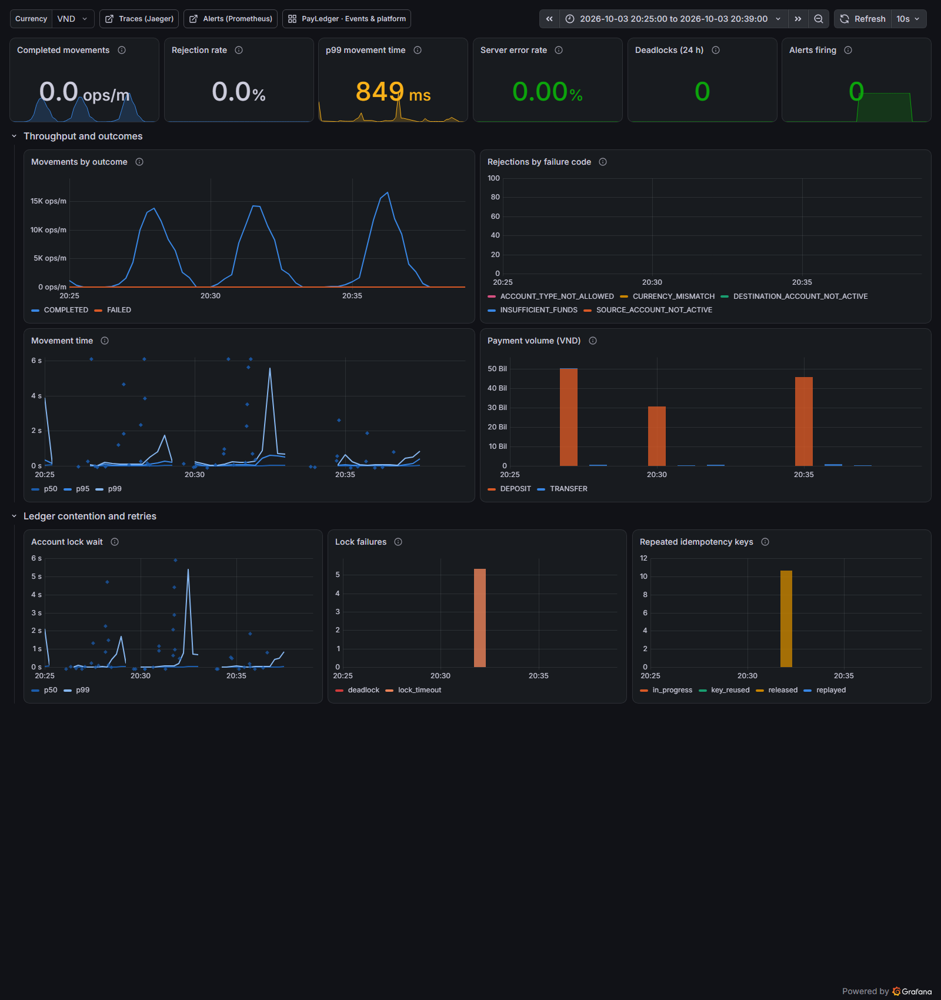
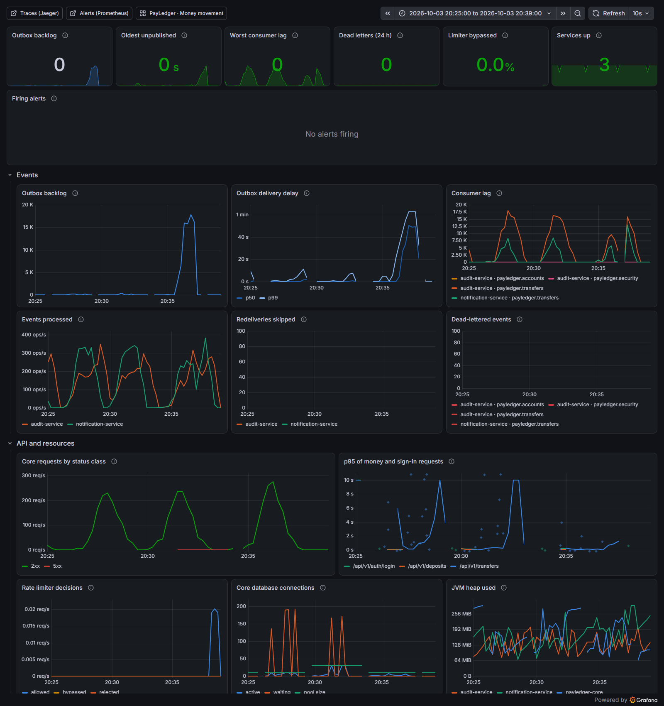

# Load test: the money path

[`transfers.js`](transfers.js) is a [k6](https://k6.io) test of `POST /api/v1/transfers`. Each request is one database
transaction that locks two accounts in id order, posts two ledger entries, updates two balances and writes two outbox
events, plus the idempotency key in its own short transactions. The outbox relay publishes the events to Kafka, and the
audit and notification services consume them, all during the test.

| Scenario | What it measures |
|---|---|
| `warmup` | 30 s at 50 transfers/s so the JIT compiler and the pools are warm; not reported |
| `spread` | 60 s of transfers between random pairs of 100 customers: little lock contention, the platform's throughput |
| `hot_account` | 30 s of transfers all paying one merchant account: every one of them queues for the same row lock ([ADR 0004](../docs/adr/0004-pessimistic-row-locking-for-transfers.md)) |

Load is generated at a constant arrival rate (open model), as real customers do not wait for each other: when the
system slows down, requests pile up instead of the load politely backing off.

## Running it

```bash
cd infra
# Rate limits off: the test sends far more than a person would, from one address.
RATE_LIMIT_ENABLED=false docker compose --profile app up -d --wait
cd ..
docker run --rm --network payledger_default \
  -v "$PWD/loadtest:/scripts:ro" -v "$PWD/loadtest/results:/results" \
  -e BASE_URL=http://core:8080 -e ADMIN_PASSWORD="$PAYLEDGER_ADMIN_PASSWORD" \
  grafana/k6:2.3.0 run /scripts/transfers.js
# Then start the core again with rate limits on: docker compose --profile app up -d core
```

`SPREAD_RATE`, `HOT_RATE` and `CUSTOMERS` change the load. The setup creates the customers and funds them through a
fresh partner-bank API key; the per-scenario table goes to `results/summary.md`.

## Results (2026-10-03)

**Machine:** one laptop, Intel Core i7-11800H (8 cores, 16 threads), 16 GB RAM, Windows 11, Docker Desktop (WSL 2,
8 GB for the VM). Everything ran on it at once: 13 containers (PostgreSQL × 3, Kafka, Redis, the three services,
nginx, Prometheus, Grafana, Jaeger with every request traced) and k6 itself.

| Run | Offered spread / hot (per s) | Completed spread / hot (per s) | spread p50 · p95 · p99 | hot_account p50 · p95 · p99 | Failed |
|---|---|---|---|---|---|
| Defaults, moderate load | 150 / 50 | 130 / 47 | 17 ms · 8.1 s · 10.4 s | 13 ms · 760 ms · 1.2 s | 0 |
| Defaults, high load | 300 / 100 | 250 / 70 | 19 ms · 951 ms · 9.5 s | 1.5 s · 12.5 s · 14.3 s | 0 |
| Connection pool 30 instead of 10 | 300 / 100 | 252 / 76 | 18 ms · 317 ms · 9.7 s | 769 ms · 10.4 s · 12.2 s | 0.04 % / 0.35 % (`LOCK_TIMEOUT`) |
| *Diagnostic:* `synchronous_commit = off` | 300 / 100 | **283 / 100** | **10 ms · 71 ms · 1.8 s** | **8 ms · 632 ms · 1.2 s** | 0 |

Completed below offered means k6 ran out of its 400 virtual users, all waiting for slow responses, and dropped the
arrivals it had no user for: the system was saturated. Every transfer that was sent completed, except the
`LOCK_TIMEOUT`s, answered `503` with `Retry-After` and safe to retry with the same key. After all the runs (108,847 transfers in the database), the ledger checks of the integration tests
([`LedgerInvariants`](../backend/src/test/java/com/payledger/support/LedgerInvariants.java), run as SQL) all held: every currency sums
to zero, no customer balance is negative, every transfer's debits equal its credits, every balance equals the sum of
its entries and its latest `balance_after`, rejected transfers have no entries. The outbox drained to zero and
the audit chain verified end to end (219,651 records).



## What the numbers say

**The median is the application; the tail is this laptop's disk.** A transfer takes 10–20 ms at the median in every
run. The p95 and p99 swing between runs (8 s at 150/s, 1 s at 300/s) because PostgreSQL waits for the WAL to reach
the disk on every commit, and Docker Desktop's virtual disk sometimes takes seconds to do so. `pg_test_fsync` on the
same volume: `fdatasync` 2.2 ms for one 8 kB write but 53 ms for two, `fsync` 145 ms to 964 ms per operation; one
checkpoint logged `sync=9.2 s, longest=5.4 s`. A commit that stalls holds its account row locks, so every transfer
queued on those accounts stalls with it, then the connection pool fills (171–191 requests waiting for one of 10
connections, a wait of up to 15 s in `hikaricp_connections_acquire_seconds`).

The diagnostic run changes only that: with `synchronous_commit = off` PostgreSQL acknowledges a commit before the WAL
is flushed, and p95 falls from 951 ms to 71 ms at a higher throughput. **This is not a setting for a bank**: a crash
could lose the last few hundred milliseconds of acknowledged payments. It is here to show where the time goes. On a
server-grade SSD or a cloud volume, a WAL flush takes well under a millisecond to a couple of milliseconds, and banks
add synchronous replication on top, so a commit is on two machines before the customer sees "money sent".

**A bigger connection pool did not help.** Going from 10 to 30 connections let more transactions wait inside
PostgreSQL instead of in the pool: p95 improved, p99 did not, and transfers to the hot account started hitting the 3 s
`lock_timeout`. As HikariCP's pool-sizing guide argues, connections beyond what the database can work on in parallel
only move the queue. The default stays at 10 per instance.

**One hot account is a serial queue.** Every payment to the merchant locks the same row, so they run one after another:
fine at 100/s when commits take a few milliseconds (the diagnostic run), and the worst tail of all when they do not.
Banks and wallets avoid the single row for accounts that busy, by spreading the merchant over sub-accounts or by
crediting it in batches (ADR 0004).

**The event pipeline lags behind, by design.** Payments never wait for Kafka: the outbox absorbs the difference. In the
fastest run, the relay of the single core instance published up to 474 events/s while transfers produced about 570,
so the backlog reached 17,000 events and the oldest waited 63 s before it drained, without an error. The audit service,
which appends to one hash chain under an advisory lock, recorded up to 347 events/s and caught up a minute after the
load stopped. A sustained rate above those figures needs more core instances (each runs a relay, `SKIP LOCKED` shares
the work) and an audit chain that appends in batches.



**Where to run it next.** For figures to quote as capacity, a Linux host with local NVMe and the load generator on
another machine; tracing sampled (`TRACING_SAMPLING_PROBABILITY=0.1`) as in production.
